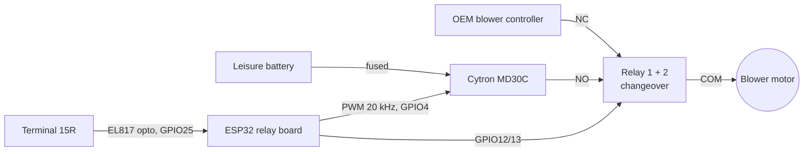

# sprinter_hvac_control

Runs the Mercedes Sprinter's (VS30) original cab HVAC blower from the
leisure battery while the vehicle is parked - for standby ventilation
without waking the vehicle electrics. Built on ESPHome, with native Home
Assistant integration and a local web UI.

The OEM climate control stays fully intact: whenever the ignition is on,
or the controller is unpowered, crashed or booting, the blower is wired to
the factory controller exactly as delivered.

<!-- PHOTO: overview / installed controller -->
<!--  -->

## Design principles

- **Fail-safe by default.** Both changeover relays rest on NC = OEM
  controller. No power, no firmware, no signal → factory behaviour.
- **Ignition always wins.** Terminal 15R active forces the OEM path
  immediately; nothing in the UI can override that.
- **Cold switching only.** Relay contacts never make or break motor
  current - PWM is at 0% and the motor has coasted down before any relay
  moves.
- **Autonomous.** All safety logic runs on the ESP32. Home Assistant is a
  remote control, not a dependency - the device works without WiFi or HA.

## Architecture



## Operation

| Entity | Type | Purpose |
|---|---|---|
| **HVAC Fan (Battery)** | `number`, 0-100 %, step 10 | The only control. 0 % = OEM, 10-100 % = battery at that duty cycle |
| Terminal 15R Active | `binary_sensor` | Ignition state as seen by the controller |
| Battery Mode Override (Skip After-Run Wait) | `switch` | Arms battery mode without waiting out `ignition_off_delay` |
| Motor Test (3s, 25%) | `button` (config) | Commissioning pulse, see below |
| LED, Restart | `light`, `button` | Board status LED, device restart |

- **0 % (default):** relays de-energized, OEM controller connected, MD30C
  PWM held at 0 %.
- **10-100 %:** relays switch the motor leads to the MD30C, which is then
  driven at the selected duty cycle. Rejected (and reset to 0 %) while
  battery mode is not armed.

### Switch-over sequence

Engage (`script.motor_engage`):
1. PWM → 0 %
2. Relays → battery (NO)
3. PWM → selected level

Disengage (`script.motor_disengage`, used by every path back to OEM -
ignition on, slider to 0 %, end of motor test):
1. PWM → 0 %
2. Wait `motor_coast_down_delay` (default 2 s) - the coasting motor still
   generates back-EMF; switching now would arc the contacts
3. Relays → OEM (NC)

### Ignition interlock (Terminal 15R)

- **Ignition on → immediately back to OEM.** Stops the after-run timer,
  disarms battery mode, clears the override, sets the slider to 0 % and
  disengages. Cannot be bypassed.
- **Ignition off → after-run timer.** Battery mode is re-armed only after
  `ignition_off_delay` (default 20 s), giving the OEM controller time to
  finish its own after-run.
- **Override** skips only the *waiting*, never the *cut-over*: the next
  ignition-on turns it off again, so re-arming after every stop is a fresh
  decision.

Terminal 15R drops essentially immediately at ignition-off. An earlier
revision used Terminal 30t, which stays live 15-30+ min after parking -
that is why the override exists; with 15R it is optional.

Both delays are `substitutions:` at the top of `relay-2ch-hvac.yaml`.

## Hardware

| Part | Notes |
|---|---|
| ESP32_Relay_30A_X2_V1.1 | ESP32-WROOM-32E, 2× Songle SLA-05VDC-SL-C SPDT (30 A), 7-28 V input with onboard 5 V buck. Photos in `information/` |
| Cytron MD30C | 5-30 V, 30 A continuous / 80 A peak (1 s), PWM+DIR interface, max. 20 kHz ext. PWM |
| 2-ch EL817 opto module | Terminal 15R level shifting / isolation, R1 470 Ω and R2 10 kΩ onboard |
| Fuse | Leisure battery → MD30C `POWER` <!-- TODO: rating --> |
| Supply cable | Battery → MD30C <!-- TODO: cross-section / length --> |

The MD30C logic input threshold is HIGH ≥ 3 V; the ESP32's 3.3 V clears
it, with little margin.

<!-- PHOTO: controller assembly (ESP32 board + MD30C + opto module) -->

### ESP32 board pinout

| Signal | GPIO | Header | Function |
|---|---|---|---|
| Status LED | 5 | onboard | board LED |
| Relay 1 | 12 | onboard | motor lead A |
| Relay 2 | 13 | onboard | motor lead B |
| MD30C `PWM` | 4 | JP2 | speed signal, 20 kHz |
| Opto `VO` | 27 | JP1 outer row | 3.3 V supply for opto output side (GPIO held high) |
| Terminal 15R sense | 25 | JP1 outer row | opto `OUT1`, active-low |

> ⚠️ Header positions were derived from photos. Verify each pin with a
> multimeter (toggle from HA, probe) before soldering permanently - a
> mirrored-photo mistake already cost one pin earlier in this project.

### Relay wiring (each relay)

| Contact | Connection |
|---|---|
| COM | blower motor lead |
| NC | OEM controller |
| NO | MD30C `MOTOR A` / `MOTOR B` |

Both relays are only ever switched together (`fan_source_battery`), so the
OEM controller and the MD30C can never share a motor lead.

### MD30C wiring

Per Cytron MD30C user's manual, Rev 1.4:

- **Jumpers:** `JP4` = don't care, `JP6` = `EXT PWM` (after the standalone
  test, see Commissioning).
- **`INPUT` header** (`GND` / `PWM` / `DIR`):
  - `PWM` → GPIO4
  - `GND` → ESP32 ground
  - `DIR` → hardwired to `GND`. The blower runs in one direction only;
    this also satisfies the manual's requirement that `DIR` or `PWM` be
    LOW at power-up, before the ESP32 has booted. Wrong direction → swap
    the motor leads, not the config.
- **`POWER`** (`+`/`-`) → leisure battery, fused. Also supplies the
  MD30C's internal logic - nothing needed from the ESP32 board.
- **`MOTOR`** (`A`/`B`) → relay NO contacts.
  ⚠️ Battery on `MOTOR` instead of `POWER` destroys the MOSFETs.
- Above 20 A the manual recommends soldering the wires to the bottom-side
  pads rather than relying on the screw terminals alone.

<!-- PHOTO: MD30C wiring detail -->

### Terminal 15R input

Terminal 15R is at vehicle voltage (12-14.4 V plus transients) and never
goes directly to a GPIO. Opto module channel 1:

| Module pin | Connection |
|---|---|
| `IVCC` | Terminal 15R (no external resistor: onboard R1 470 Ω → ~25 mA at 13 V, ~29 mA at 15 V; module max. 50 mA) |
| `SIN1` | vehicle ground |
| `VO` | GPIO27 |
| `OUT1` | GPIO25 (pull-up is the onboard R2 10 kΩ) |
| `OGND` | ESP32 ground |

The output is active-low; `inverted: true` in the config makes
`Terminal 15R Active` read "on" while the ignition is on.

**VO from a GPIO:** neither board breaks out a spare 3.3 V pin, so `VO` is
fed from GPIO27, held high (`restore_mode: ALWAYS_ON`). Load is
3.3 V / 10 kΩ ≈ 0.33 mA - trivial for a GPIO, but it has no short-circuit
protection, so don't reuse it for anything with real current. During
boot, before GPIO27 is driven, the input may read wrong for a moment;
this cannot engage battery mode, because relays start `ALWAYS_OFF` and
`battery_mode_allowed` starts `false`.

<!-- PHOTO: Terminal 15R tap / opto module -->

### Power supply

The relay board's 3-pin terminal (`7-28V` / `GND` / `5V`) takes 12 V and
provides 5 V from its onboard buck converter for the ESP32 and both relay
coils (~70-90 mA each).

The regulator was identified only from its silkscreen ("…2596S", 33 µH
inductor) as an LM2596-type 3 A buck; the exact marking returned no
datasheet. <!-- TODO: replace with measured value --> Measure the 5 V
terminal with both relays energized before relying on it.

The MD30C is independent of this rail (see above). Only `GND` and `PWM`
connect the two boards.

## Measured current draw

Measured on the installed blower (real ductwork) with a Victron
SmartShunt on the leisure battery. Baseline camper load ~3.5 A subtracted.

| PWM | Blower current |
|---|---|
| 10 % | ~0.5 A |
| 20 % | ~0.7 A |
| 30 % | ~1.5 A |
| 40 % | ~2.7 A |
| 50 % | ~4.5 A |
| 60 % | ~7.5 A |
| 70 % | ~10 A |
| 80 % | ~13.3 A |
| 90 % | ~17.5 A |
| 100 % | ~22 A |

~22 A at 100 % leaves ~8 A headroom to the MD30C's 30 A continuous
rating.

## Commissioning

1. **MD30C standalone:** `JP4` = `INT POT`, `JP6` = `INT PWM`, battery and
   motor connected, spin with Test Button A/B and the onboard pot. No
   microcontroller involved.
2. **5 V rail:** measure the relay board's 5 V output with both relays
   energized.
3. **GPIO positions:** toggle each output from HA and probe the header
   pin before soldering.
4. **Jumpers to external:** `JP4` = don't care, `JP6` = `EXT PWM`, wire
   the `INPUT` header.
5. **Interlock:** ignition on/off, check `Terminal 15R Active` and that
   the slider is rejected during the after-run.
6. **Motor Test button:** 3 s at 25 %, then normal disengage. Wrong
   direction → swap motor leads.
7. **Bench first:** all of the above was done on a spare used blower and
   OEM controller before touching the vehicle.

## Files

| File | Content |
|---|---|
| `relay-2ch-hvac.yaml` | Device config: relays, PWM, interlock, scripts, entities |
| `.basics.yaml` | Shared base (WiFi + fallback AP, API, OTA, web server, WiFi watchdog), included via `packages:` |
| `secrets.yaml.example` | Template - copy to `secrets.yaml` (git-ignored) |
| `information/` | Board photos and reference material |

```bash
cp secrets.yaml.example secrets.yaml   # fill in
esphome run relay-2ch-hvac.yaml
```

## Design notes

**`number` instead of `fan:`** - ESPHome's template fan publishes state
optimistically before `on_turn_on`/`on_speed_set` run, with known ordering
issues between turn-on and speed (esphome/esphome#10844). For a
safety-relevant switch-over the sequence must be owned explicitly;
`number` with `set_action` does that. Step 10 keeps phone input on round
values.

**MD30C instead of IBT-2** - the first build used an IBT-2 (BTS7960)
H-bridge. That unit was dead on arrival (correct logic levels at every
input, almost no output even unloaded), a common failure of these clone
boards. The blower never reverses, so an H-bridge was unnecessary anyway;
the MD30C is simpler, properly documented and sized for the load. GPIO16,
17, 18 and 34 used by the IBT-2 revision are now free.

## Disclaimer

Modifying vehicle electrics is at your own risk. This is a personal
project documented as built, not a product.
